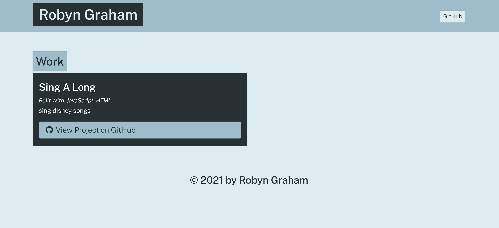

# Portfolio Generator

Generate your porfolio website from the command line. Answer prompts about your projects, github link, descriptions and about yourself. Add multiple projects, and designate featured projects. 

## How to use
Download from the reposistory: https://github.com/robyng/portfolio-generator

CD to the file in your terminal. Type 'node app.js' to start prompts. 

View the new website from project-generator/utils/index.html

## Portfolio Template
